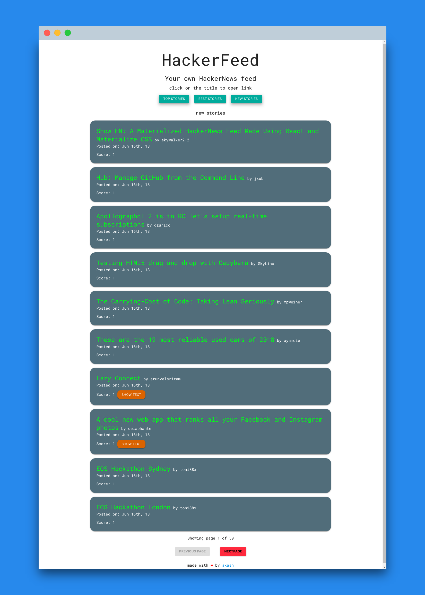

# hacker-feed

[](https://travis-ci.com/skywalker212/hacker-feed)

A side project to develop a pretty HackerNews Feed. check out the live version : [hacker-feed](https://skywalker212.github.io/hacker-feed/)

Are you bored with the amazing interface of HackerNews Feed? I was too (not saying that the classic UI is not good). Here I present you a materialized HackerNews Feed using materialize css and React. I am soon thinking of adding user login function so that users can save their favorite stories.

I have used HackerNews API to query the stories, you can check it out [here](https://github.com/HackerNews/API).

Travis CI is running in behind the scenes to make my life easier to publish the live-minified version of this site. I used create-react-app to get the react boilerplate but I had a lot of trouble in configuring the test suit and other stuff so I have decide to use my own react boilerplate from the next time.

brace yourselves for a pretty long snap of hacker-feed.


## file-structure info

- public

    this is the folder where our main index.html resides.
- src

    this is where all the react code lingers

    - actions

        helper functions to make my life easier setting up redux states

    - componets

        various react components that need to rendered, reside here

    - reducers

        our state reduce which works night and day lives in this folder

    - store

        file to configure redux store, setup reducer, is kept here

    - style

        this folder prettifies our react components

    - test

        out test suite resides here

    - index.js : this is our entry point to the react app

## get up and runnin

1. clone this repo using ```git clone```
2. ```yarn start``` to host it on local server
3. ```yarn test``` to start testing

## contribute

1. fork this repo
2. make changes, fix bugs, implement new features
3. make a pull request
